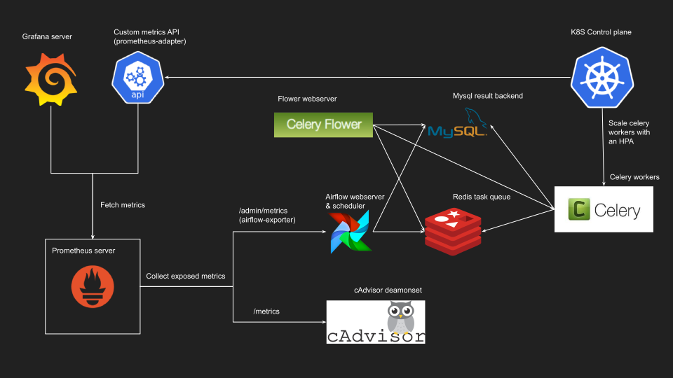

# k8s-airflow (Autoscaled Celery Executor)

[  ](./img/airflow-k8s-infra.svg)

## Installing

```bash
make
```

As we use a custom resource definition for the custom metrics API, [a race condition might occur](https://github.com/coreos/prometheus-operator/issues/1866#issuecomment-419191907) when applying the cluster configuration, if you encounter the `no matches for kind "ServiceMonitor" in version "monitoring.coreos.com/v1"` error, try waiting some seconds before retrying `make`

## What will be deployed

### Full cluster topology (click to enlarge)

[  ](./img/airflow-k8s-infra-2.svg)

### Airflow

Airflow pods running `airflow webserver` & `airflow scheduler` with pre-installed [airflow-exporter](https://github.com/epoch8/airflow-exporter) project to expose metrics to `/admin/metrics`

By default, i'm using my own image hosted on docker hub (`jjaniec/airflow-exporter`) but you can easily make your own using something like:

```Dockerfile
FROM apache/airflow:master
RUN pip install --user airflow-exporter
```

New dags are pulled using the git-sync method, repo config and credentials can be set in `src/airflow/git-sync.secret.yaml`

### Celery

Celery pods to execute tasks in a distributed way, in a `StatefulSet` scaled by an `HorizontalPodAutoscaler`.

By default, the metric used by the hpa to scale celery pods is the `airflow_tasks_per_worker`, defined in the prometheus adapter config as:

```
(number of pending tasks) / (celery workers count)

OR in PromQL:
ceil(
    max(
        sum(airflow_task_status{<<.LabelMatchers>>,status=~"up_for_retry|up_for_reschedule|queued|running|scheduled|none"})
        by (namespace, service)
        / ignoring (namespace, service) group_left count(container_memory_usage_bytes{container_label_run="celery"})
        by (namespace, service)
        or up - 1)
    by (namespace, service)
)
```

Tasks are fetched and results are stored on local `redis` & `mysql` deployments

### Grafana

A simple grafana server will be deployed fetching metrics from the prometheus server, with a base dashboard containing cpu / memory and autoscaling metrics from the airflow cluster

### cAdvisor

To expose node metrics, collected by the prometheus server, and used to calculate total count of running celery workers by the celery hpa

### [prometheus-operator](https://github.com/coreos/prometheus-operator)


Prometheus server with service discovery on the `airflow` and `cAdvisor` services

### [prometheus-adapter](https://github.com/DirectXMan12/k8s-prometheus-adapter)


Custom metrics api to use prometheus metrics with the celery statefulset hpa

### Notes

By default, scaling in of celery workers by the hpa will take 5 minutes, if you want to speed up the process and have a faster scaling in of the workers, see: [hpa-support-for-cooldown-delay](https://kubernetes.io/docs/tasks/run-application/horizontal-pod-autoscale/#support-for-cooldown-delay)

### Documentation / Useful links

- [https://kubernetes.io/docs/tasks/access-kubernetes-api/custom-resources/custom-resource-definitions/](https://kubernetes.io/docs/tasks/access-kubernetes-api/custom-resources/custom-resource-definitions/)

- [https://kubernetes.io/docs/tasks/run-application/horizontal-pod-autoscale/#support-for-metrics-apis](https://kubernetes.io/docs/tasks/run-application/horizontal-pod-autoscale/#support-for-metrics-apis)

- [https://github.com/DirectXMan12/k8s-prometheus-adapter/blob/master/docs/config.md](https://github.com/DirectXMan12/k8s-prometheus-adapter/blob/master/docs/config.md)

- [https://stefanprodan.com/2018/kubernetes-horizontal-pod-autoscaler-prometheus-metrics/](https://stefanprodan.com/2018/kubernetes-horizontal-pod-autoscaler-prometheus-metrics/)
